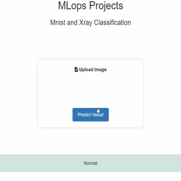

<h1 style="text-align: center;">ML_Deployment</h1>

# Mnist & Chest Xray-Image Classification Using PyTorch & Deploy on TorchServe Server Using Docker & Docker Compose
============================================================================================

## Introduction
Mnist and Chest Classification is a deep learning project that uses PyTorch to classify Mnist and Chest X-ray images. The project also demonstrates how to deploy the model on TorchServe server using Docker and Docker Compose.

## Technologies
* 
* 
* 
* 
* 
* 
* 
* 
* 
* 
* 
* 
* 
* 
* 
* 
* 
* 


## Features
### Model Training
* Train a PyTorch model on Mnist and Chest X-ray datasets
* Implement data augmentation and preprocessing techniques
* implement model from scratch and save on .pt files

### Model Deployment
* Deploy the trained model on TorchServe server using Docker
* Use Docker Compose to manage multiple containers
* Implement model serving and inference using TorchServe API

### Docker and Docker Compose
* Create a Docker image for the PyTorch model
* Use Docker Compose to manage multiple containers for the model, TorchServe server, and database

## Getting Started
### Prerequisites
* Python 3.8 or later
* PyTorch 1.9 or later
* Docker and Docker Compose installed on your system

### Installation
* Clone the repository: `git clone https://github.com/mobinghasemi/ML_Deployment.git`

### Running the Project
#### MnistApp
* copy mnist_index.html to the /app/templates/index.html
* copy mnist_app.py to the /app/app.py
##### VScode Terminal
```dockerfile
docker compose up --bulid
```
##### PC Terminal
```dockerfile
docker ps
docker exec -u 0 -it container-id(torchserve container) /bin/bash
```
```bash
cd /
cd /codes
ls -ltrha
torch-model-archiver --model-name mnist --version 2.0 --model-file arch.py --serialized-file mnist.pt --handler mnist_handler_base.py --force
cp mnist.mar /home/model-server/model-store
torchserve --stop
torchserve --start --model-store /home/model-server/model-store --models mnist=mnist.mar --disable-token-auth --enable-model-api --ts-config /home/model-server/config.properties    
```
##### Browser
```curl
localhost:9696
```

#### XrayApp
* copy xray_index.html to the /app/templates/index.html
* copy xray_app.py to the /app/app.py
##### VScode Terminal
```dockerfile
docker compose up --bulid
```
##### PC Terminal
```dockerfile
docker ps
docker exec -u 0 -it container-id(torchserve container) /bin/bash
```
```bash
cd /
cd /codes
ls -ltrha
torch-model-archiver --model-name xray --version 1.0 --model-file xray_arch.py --serialized-file xray.pt --handler xray_handler_base.py --force
cp xray.mar /home/model-server/model-store
torchserve --stop
torchserve --start --model-store /home/model-server/model-store --models xray=xray.mar --disable-token-auth --enable-model-api --ts-config /home/model-server/config.properties    
```
##### Browser
```curl
localhost:9696
```


## Outputs
### MnistApp


### XrayApp




## Usage
* Use the TorchServe API to send inference requests to the model
* Use the provided Python script to test the model and visualize the results

## Contributing
Contributions are welcome! If you'd like to contribute to the project, please submit a pull request or report an issue.

## License
This project is licensed under the MIT License.
